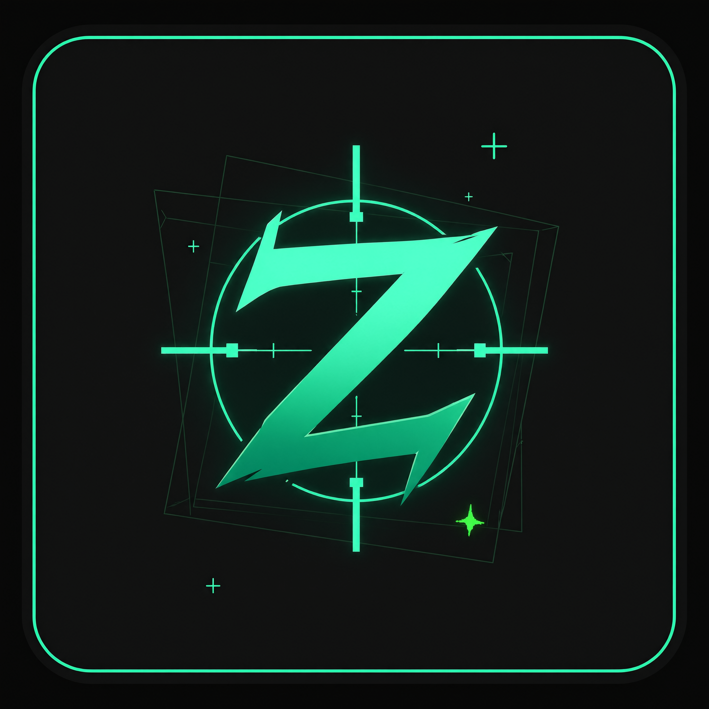

<div align="center">



# ZenWare.cc (Deutsch)

**Interne + externe Trainingssoftware für Left 4 Dead 2**

`x86` · `C++17` · `Visual Studio 2022` · `MinHook` · `v3.8.1`

[← Zurück zur Haupt-README](README.md)

</div>

---

> **Nur Sourcecode · Nur Lernen und lokale Server.**
> Keine fertigen `.exe` / `.dll` in diesem Repo oder in Releases — selbst bauen,
> Spiel mit `-insecure` starten, eigene Map spielen (`map c1m1_hotel`).
> VAC-Server = Bannrisiko. Auf eigenes Risiko.

🇬🇧 [English](README.md) · 🇷🇺 [Русский](README_RU.md) · 🇪🇸 [Español](README_ES.md) · 🇵🇹 [Português](README_PT.md) · 🇵🇱 [Polski](README_PL.md) · 🇫🇷 [Français](README_FR.md) · 🇨🇳 [中文](README_ZH.md)

## Deutsch

### Über das Projekt

ZenWare.cc ist eine Trainings-Sandbox für Left 4 Dead 2 (Source-Engine,
2009): Rendern, Prediction, Movement und Netzwerk lernen — am eigenen PC,
am eigenen Server, mit `-insecure`. Kein VAC-Bypass, keine offiziellen
Server, keine fertigen Binaries.

Der Code basiert auf [Lak3/l4d2-internal-base](https://github.com/Lak3/l4d2-internal-base)
und ist zu drei Tools in einer Solution gewachsen (`ZenWare.sln`, `Release | Win32`):

| Teil | Modus | Was es tut | Output |
|---|---|---|---|
| `ZenWare.DLL` | Internal (injected) | Voller Cheat: Ecken-ESP, Chams, Aimbot, Movement, Ingame-Menü | `bin/Release/ZenWare.dll` (x86, /MT) |
| `ZenWare.Loader` | GUI-Loader, nur lokaler Build | Manual-map / LoadLibrary-Inject, Themes, 8 Sprachen | lokales `dist/ZenWare.exe`, wird nie veröffentlicht |
| `ZenWare.External` | External (kein Inject) | RPM-Reads + GDI-Overlay + Bhop/Strafe per `SendInput` | `bin/Release/ZenWare.External.exe` |

Neu hier? Starte mit dem **External**-Overlay — es schreibt nie in den
Spielespeicher und ist der sicherste Weg, die Pipeline zu lernen.
Details: [SECURITY.md](SECURITY.md) · Fremdcode: [NOTICE.md](NOTICE.md) ·
Lizenz: [LICENSE](LICENSE) · Aufbau: [ARCHITECTURE.md](ARCHITECTURE.md).

### Wie es funktioniert

**Internal DLL.** Beim Inject startet `DllMain` einen Thread (Logik läuft
nie auf dem Loader-Lock), `Entry::Load` folgt einer fail-closed Reihenfolge:
Logger → Crash-Recorder → Warten auf `serverbrowser.dll` → Pattern-Scan
(mit RVA-Cache `ZenWare.offsets`) → Interfaces (`VEngineCvar007` zuerst in
`vstdlib.dll`) → Netvars → `MinHook`-Hooks → Config laden. Fehlendes Pattern
oder Interface = MessageBox statt Crash.

Pro Frame laufen zwei Ketten:

- **Tick** (`ClientMode::CreateMove`) — Prediction, Movement (BunnyHop →
  AutoStrafe → JumpStats → AutoShove), Combat (Aimbot → TriggerBot →
  AutoPistol → NoSpread). Das Engine-Original wird exakt einmal pro Tick
  aufgerufen.
- **Frame** (`EngineVGui::Paint`, nur `PAINT_UIPANELS`) — Thirdperson- /
  Fullbright- / Hide-Hands-CVars, Killfeed-Tick, Hitmarker-Tick, ESP, Radar,
  Alerts, Menü, Crosshair, Granaten-Vorschau, Overlay und animierte
  Killfeed- / Hitmarker- / JumpStats-Draws.

Keine Engine-Events by design — Killfeed und Hitmarker pollen HP/alive-
Wechsel. Gezeichnet wird nur über `G::Draw` auf `MatSystemSurface`;
Entities werden nur per Netvars mit `ClassID`-Check vor virtuellem Aufruf
gelesen.

**Loader.** Win32-GUI mit Splash, System-Dark/Light-Theme, 8 Sprachen und
animiertem RGB-Logo. DLL, External und Logo sind als Ressourcen eingebettet —
ein Output-File. Inject per Manual-Map (Relocations, Imports, Section-
Schutz, Header-Wipe) mit `LoadLibrary`-Fallback. Kein Netzwerk, kein
Auto-Update.

**External.** Nur lesend: `ReadProcessMemory`-Snapshots mit 20 Hz,
Click-through-GDI-Overlay mit 60 Hz, Movement nur per `SendInput`. Der
Resolver (Signatur + Anker + Validierung) findet Adressen bei jedem Start.

### Features

<details open>
<summary><b>Visuals</b> — ESP · Chams · Overlays</summary>

- **ESP** — Ecken (teamfarbig), HP-Balken mit Rahmen + optionaler HP-Text,
  Namen mit Schatten, Distanz, Waffen mit Magazin-Munition, Items, Commons,
  alle Special Infected inkl. Boomer (Klassennamen-Fallback), optionales
  ESP-Distanzlimit, dezente Snaplines
- **Chams** — 5 Paletten, eigene Farben für Gegner / Mates / Tank,
  Through-Walls-Schalter, Ghost- und Dormant-Filter
- **Welt** — NoFog, Fullbright-Schalter, getrennte FOV-Slider (Welt +
  Viewmodel), Thirdperson mit Distanz, Viewmodel verstecken, eigenes
  Crosshair, FPS- / Positions- / HP-Overlay, Zähler lebender Commons
- **Intel** — 2D-Radar mit Yaw-Rotation, Spectator-Liste, Tank- / Witch-
  Alarme, gepollter Killfeed mit animierten Cards, Hitmarker mit Hitsound,
  Schadenszahlen, Trefferkreuz und Session-Stats
- **Teamplay** — Pin-Warnung (Smoker/Hunter), Revive-Alarm, Tank-HP-Balken,
  Team-HP-Panel, Nearby-SI-Liste mit eigenem Panel, Spit-Alarm, Timer für
  geworfene Granaten (Pipe / Molotov-Feuer)
- **Feedback** — roter Schadens-Flash, Schadens-Richtungspfeil zum letzten
  Angreifer, Min-Damage-Filter, Waffen-HUD mit Munition (Magazin + Reserve),
  gelbes `RELOADING` und rote Low-Ammo-Warnung
- **Granaten** — Flugbahn-Vorschau (Molotov / Pipe / Galle /
  Granatwerfer) mit Bounce-Simulation und Lande-Marker

</details>

<details>
<summary><b>Combat</b> — Aim-Hilfe</summary>

- **Aimbot** — Silent Aim, FOV- / Distanz-Priorität, Kopf- / Center-Punkt,
  Smoothing, Nur-Sichtbar-Check, Key-Bind, Commons + alle SI + Tank
- **Pro Waffe** — eigene FOV / Smoothing / Hitbox pro Gruppe (Rifles, SMGs,
  Shotguns, Sniper, Pistolen)
- **Helfer** — TriggerBot (schießt auf dem Post-Aim-Strahl, kein 1-Tick-Lag),
  AutoShove (befreit gepinnte Mates), AutoPistol, NoSpread (11-Waffen-
  Whitelist, standardmäßig an)

</details>

<details>
<summary><b>Movement</b> — Bhop & Strafe</summary>

- **Bhop-Kit** — Perfect / Legit BunnyHop, EdgeJump, EdgeBug, JumpBug,
  LongJump-Helfer, FastStop, Prestrafe, AutoDuck, Jump-Delay einstellbar
- **Strafe** — Legit / Rage / W-only / Directional AutoStrafe
- **JumpStats** — KZ-Panel: Distanz, Prestrafe, Max-Speed, Fall, Sprunghöhe,
  Airtime, Live-Sync-% in der Luft, Strafe-Count, JB- / EB-Session-Zähler

</details>

<details>
<summary><b>Menü / System</b></summary>

- Ingame-Menü (`INSERT`): 5 Tabs (Visuals / Move / View / Combat / Misc),
  Scroll pro Tab, RGB-Logo, `?`-Hilfe (EN + RU), Farb-Swatches, Key-Binds,
  Slider, Panic-Key versteckt ESP sofort
- 8 Sprachen mit Live-Wechsel (Button oder `F7`):
  EN / RU / DE / ES / PT / PL / FR / ZH
- Config — 3 Slots (`ZenWare.cfg` / `ZenWare2.cfg` / `ZenWare3.cfg`),
  `bool / int / float / Color`, Float-Slider per Int-Proxy mit Resync
- Logger — `%TEMP%/ZenWare.log` wandert nach `<gamedir>/ZenWare.log`
  (per-PID-Fallback), Crash-Records als `module+offset` mit Breadcrumbs
- Offset-Cache — `<gamedir>/ZenWare.offsets` (auto, löschen für Rescan);
  `Tools/SigScan` prüft alle 15 Patterns offline an deinen Spieldateien

</details>

### Bauen & Starten — nur lokal

**1. Bauen** (Visual Studio 2022 mit `Desktop-Entwicklung mit C++`):

```powershell
powershell -ExecutionPolicy Bypass -File Build-SingleFile.ps1
```

**2. Spiel** — Steam → L4D2 → Startoptionen:

```text
-insecure -windowed -console
```

**3. Map** — Konsole im Spiel:

```text
map c1m1_hotel
```

**4. Inject** — selbst gebauten Loader **als Administrator** starten → `INJECT`.

Nur External (kein Inject): lokales
`ZenWare.External/bin/Release/ZenWare.External.exe` oder `START-ZenWare.bat` starten.

> Das gebaute `exe` nicht in öffentliche GitHub-Releases laden. Source-only-Policy: [SECURITY.md](SECURITY.md).

### Voraussetzungen

| Was | Version |
|---|---|
| OS | Windows 10/11 x64 |
| Spiel | Steam + Left 4 Dead 2 |
| IDE | Visual Studio 2022 + `Desktop-Entwicklung mit C++` |
| SDK | Windows SDK `10.0.26100.0` |
| Ziel | `Release` · `Win32` (x86) |

### Tasten

| Taste | Aktion |
|:---:|---|
| `INSERT` | Menü auf / zu |
| `F11` | Unload |
| `F7` | Sprache EN / RU / DE / ES / PT / PL / FR / ZH |
| `Space` (halten) | BunnyHop (Standard) |
| `MOUSE4` (halten) | Aimbot (Standard) |

Umbinden: `Misc → Menu key / Aimbot key` — Klick → `[press key]` → Taste drücken, `ESC` = aus.
Panic-Key versteckt alle Boxen sofort (`Visuals → ESP`).

### Configs & Logs

- Slots neben dem Spiel-DLL-Pfad: `ZenWare.cfg`, `ZenWare2.cfg`,
  `ZenWare3.cfg` — plain `key=value`, 117 Keys. Session-Werte (JB/EB-
  Zähler) werden nie gespeichert.
- Log: `<gamedir>/left4dead2/ZenWare.log`. Crashs sehen so aus:
  `[!!!] EXCEPTION code=... at module+0x...` + letzte Breadcrumb — das Paar
  reicht, keine Dumps nötig.
- Signatur-Cache: `<gamedir>/left4dead2/ZenWare.offsets` (RVAs + Modul-
  Fingerprint); nach Game-Update löschen oder `Verify-Signatures.bat`
  laufen lassen und `Offsets.cpp` bei `NOT FOUND` fixen.

### Projektstruktur

```text
ZenWare.cc/
├── ZenWare.sln                  Solution (DLL + Loader + External)
├── ZenWare.DLL/                 Internal-Modul
│   ├── src/Entry/               Init-Reihenfolge, Crash-Recorder, Unload
│   ├── src/Hooks/               ClientMode / EngineVGui / ModelRender / WndProc …
│   ├── src/SDK/                 L4D2-Interfaces, Entities, DrawManager, GameUtil
│   ├── src/Features/            Vars (Settings) + Aimbot/ESP/Menu/… + Config + Lang
│   └── src/Util/                Logger, Pattern, Offsets-Cache, NetVars, MinHook
├── ZenWare.Loader/              GUI-Loader — nur lokaler Build, kein Auto-Update
├── ZenWare.External/            External-Overlay — ESP, Memory, Movement, Overlay
├── Tools/SigScan/               Signatur-Check an deiner client.dll
├── .github/workflows/           CI-Buildcheck — kein Binary-Upload
├── dist/                        nur lokaler Output (git-ignored)
├── Build-SingleFile.ps1         lokaler Builder (kein Publish)
├── Verify-Signatures.bat        Pattern-Check an deinen Spieldateien
├── START-ZenWare.bat            lokaler External-Start
├── README.md · LICENSE · NOTICE.md · SECURITY.md · CHANGELOG.md · ARCHITECTURE.md
└── README_RU/DE/ES/PT/PL/FR/ZH.md   Übersetzungen dieser Datei
```

### Probleme

| Symptom | Lösung |
|---|---|
| `XorString` / `FATAL ERROR` beim Start | Signatur nach Game-Update kaputt → `Verify-Signatures.bat`, `Offsets.cpp` fixen |
| Crash im Spiel | Log öffnen → `[!!!] EXCEPTION` finden → `module+0x...` + letzte Breadcrumb melden, keine Dumps |
| Antivirus-Alarm | Ordner → Ausnahmen (Heuristik auf `WriteProcessMemory` / `CreateRemoteThread`) |
| Quadrate statt Buchstaben | `F7` drücken (Font-Fallback / Sprache) |
| External: keine Boxen | Obere Overlay-Zeilen prüfen (Resolver-Diagnose) und Signaturen |
| Menü offen, Klicks gehen ins Spiel | Erst das Spiel-Menü schließen (der Cheat fängt `ESC` nur ab, wenn sein Menü offen ist) |

## Rechtliches

| Thema | Bedingungen |
|---|---|
| Lizenz | MIT — [LICENSE](LICENSE), `AS IS`, keine Garantie |
| Fremdcode | [NOTICE.md](NOTICE.md): MinHook, FontAwesome, Valve-SDK-Header, Base |
| Marken | Left 4 Dead 2 / Steam von Valve. Nicht affiliated, nicht endorsed |
| Vertrieb | Nur Sourcecode — [SECURITY.md](SECURITY.md), keine Binaries |
| Nutzung | Nur lokales `-insecure`. Kein VAC-Bypass. Banns sind deine |

<div align="center">

**Credits** ·
Base: [Lak3/l4d2-internal-base](https://github.com/Lak3/l4d2-internal-base) ·
Hook-Engine: MinHook (Tsuda Kageyu, BSD-style) ·
Icons: [FontAwesome 6 Free](https://fontawesome.com)

</div>
